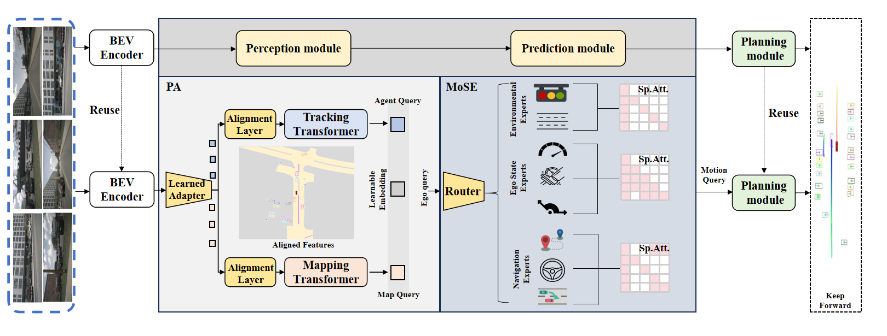
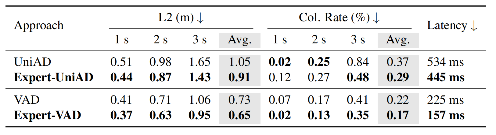

   

# ExpertAD:Enhancing Autonomous Driving Systems with Mixture of Experts

## Intro

- We propose a **Perception Adapter (PA)** to filter redundant driving environment information and a Mixture of Sparse Experts (MoSE) to reduce the driving task interference.
- We propose **ExpertAD**, which is a novel framework that integrates the lightweight efficiency of the Mixture of Experts (MoE) framework into ADSs.
- We integrate ExpertAD into two state-of-the-art vision-only ADSs, and conduct large scale experiments to show improved planning effectiveness and lower inference latency on benchmark datasets.

## Getting Started

   - [Installation](docs/INSTALL.md)
   - [Prepare Dataset](docs/DATA_PREP.md)
   - [Train/Eval](docs/TRAIN_EVAL.md)
## Results

**ExpertAD** achieves better planning effectiveness and lower inference latency on the nuScenes dataset compared to the baseline models (*i.e*., UniAD and VAD). The latency of ExpertAD and baseline models is mea sured on a single NVIDIA Tesla A100 GPU

## Catalog
- [x] Code Release
- [x] Initialization
